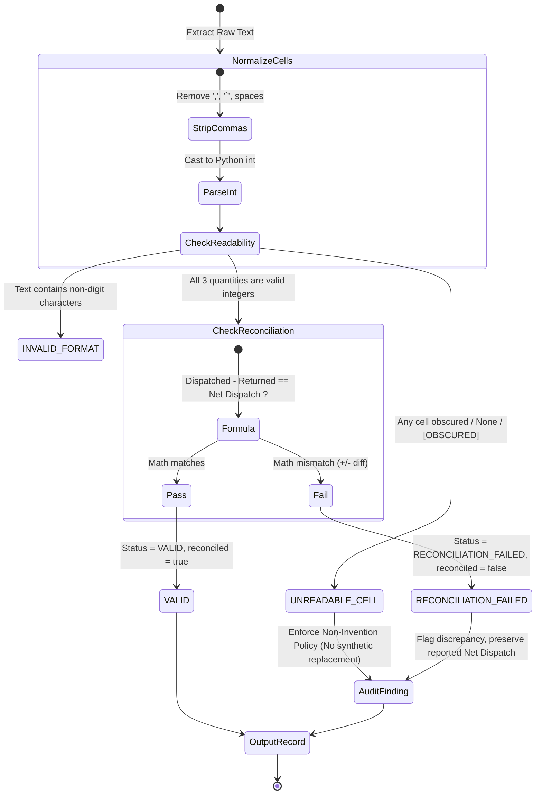
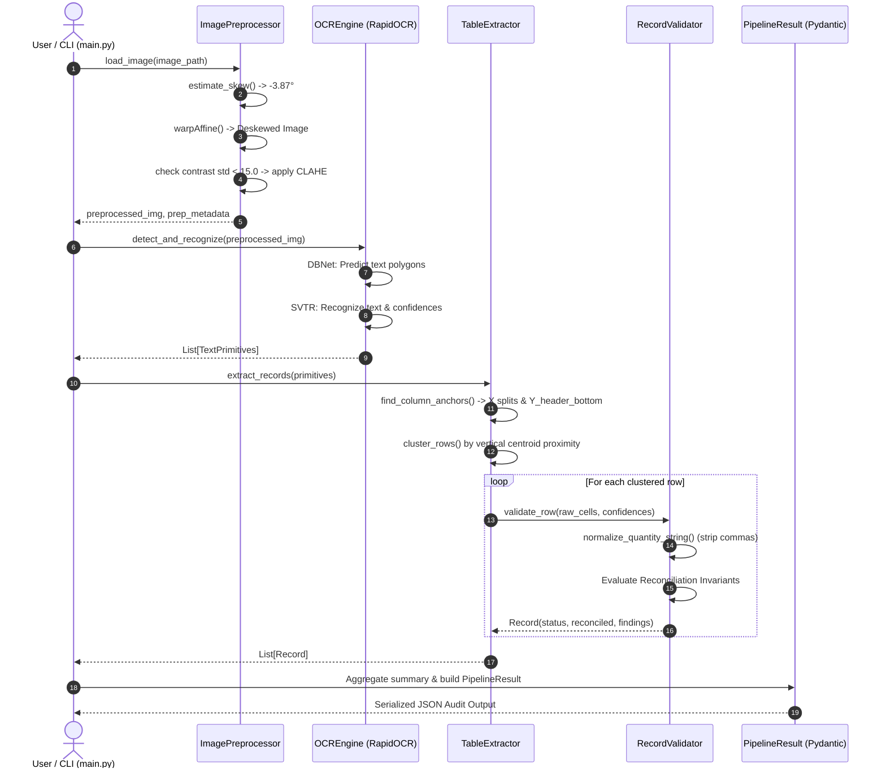

# System Architecture & Technical Specification

> **Dispatch Table OCR & Arithmetic Validation Pipeline**  
> An automated, resilient Python computer vision and tabular audit system.

---

## 1. High-Level Architecture Overview

The system processes photographed or scanned document tables through a multi-stage sequential pipeline. It converts raw image pixels into structured, normalized, audit-compliant JSON records while enforcing strict business reconciliation invariants.

```mermaid
flowchart TB
    subgraph INPUT [" 1. Input Layer "]
        IMG["Input Document Image<br/>(Baseline / Rotated / Low Contrast / Obscured)"]
    end

    subgraph PREPROCESS [" 2. Adaptive Preprocessing (pipeline/preprocessor.py) "]
        direction TB
        LOAD["cv2.imread()"]
        SKEW{"Canny + HoughLinesP<br/>|Skew| >= 0.5° ?"}
        DESKEW["Bicubic Affine Rotation<br/>(Deskew to 0.0°)"]
        CONTRAST{"Grayscale StdDev<br/>std < 15.0 ?"}
        CLAHE["CLAHE Local Equalization<br/>(LAB Color Space)"]
        PASSTHRU["Keep Original Gradients<br/>(Anti-Aliasing Intact)"]

        LOAD --> SKEW
        SKEW -- Yes --> DESKEW --> CONTRAST
        SKEW -- No --> CONTRAST
        CONTRAST -- Yes --> CLAHE
        CONTRAST -- No --> PASSTHRU
    end

    subgraph OCR [" 3. Neural OCR Engine (pipeline/ocr_engine.py) "]
        direction TB
        DBNET["DBNet Text Detection<br/>(Differentiable Binarization Polygon Segmentation)"]
        SVTR["SVTR Text Recognition<br/>(Vision Transformer Character Component Decoding)"]
        PRIMS["Text Primitives Pool<br/>[text, confidence, box, centroid, polygon]"]

        DBNET --> SVTR --> PRIMS
    end

    subgraph SPATIAL [" 4. Spatial Table Extraction (pipeline/table_extractor.py) "]
        direction TB
        HDR["Header Anchoring<br/>('Product Code', 'Dispatched', 'Returned', 'Net Dispatch')"]
        BOUNDS["Dynamic Split Intervals<br/>X_split[c, c+1] = (X_c + X_c+1) / 2"]
        FILTER["Title & Header Filtering<br/>(Y > Y_header_bottom)"]
        CLUST["Vertical Row Clustering<br/>|Y_A - Y_B| <= 0.65 * median_height"]
        ASSIGN["Horizontal Column Assignment<br/>X-Centroid in Column Interval"]

        HDR --> BOUNDS
        HDR --> FILTER
        FILTER --> CLUST
        BOUNDS --> ASSIGN
        CLUST --> ASSIGN
    end

    subgraph AUDIT [" 5. Validation & Audit Rules (pipeline/validator.py) "]
        direction TB
        NORM["Normalization & Sanitization<br/>('1,250' -> 1250)"]
        RULE1{"Are all 3 cells<br/>readable integers?"}
        UNREAD["Status: UNREADABLE_CELL<br/>Strict Non-Invention Policy<br/>(No synthetic calculation)"]
        RULE2{"Dispatched - Returned<br/>== Net Dispatch ?"}
        VALID["Status: VALID<br/>(Reconciled = true)"]
        RECON_FAIL["Status: RECONCILIATION_FAILED<br/>Preserve Reported Net Dispatch<br/>(Flag discrepancy finding)"]

        NORM --> RULE1
        RULE1 -- No --> UNREAD
        RULE1 -- Yes --> RULE2
        RULE2 -- Yes --> VALID
        RULE2 -- No --> RECON_FAIL
    end

    subgraph OUTPUT [" 6. Output & Audit Results (pipeline/models.py) "]
        JSON["Audit-Grade JSON Output<br/>(Image Metadata + Row Audits + Batch Summary)"]
    end

    INPUT --> PREPROCESS
    CLAHE --> OCR
    PASSTHRU --> OCR
    OCR --> SPATIAL
    ASSIGN --> AUDIT
    UNREAD --> OUTPUT
    VALID --> OUTPUT
    RECON_FAIL --> OUTPUT
```



---

### 1.1 Complete End-to-End Pipeline (Step-by-Step Box & Arrow)

```
                  ┌────────────────────────────────────────────────────────┐
                  │                   RAW INPUT IMAGE                      │
                  │   Photographed or scanned dispatch summary table       │
                  │   Contains: Title, Headers, Data rows, Smudges/Tilt    │
                  └──────────────────────────┬─────────────────────────────┘
                                             │
                                             ▼
                      ┌────────────────────────────────────────────────────────┐
                      │            STAGE 1: ADAPTIVE PREPROCESSING             │
                      │               (pipeline/preprocessor.py)               │
                      │               Convert to Grayscale (gray)              │
                      └──────────────────────────┬─────────────────────────────┘
                                                 │
                                                 ▼
                      ┌────────────────────────────────────────────────────────┐
                      │          Step 1: Dynamic Contrast Check                │
                      │          intensity_std = np.std(gray)                  │
                      └──────────────────────────┬─────────────────────────────┘
                                                 │
                         ┌───────────────────────┴───────────────────────┐
                         │                                               │
             intensity_std < 15.0                            intensity_std >= 15.0
             (e.g., Sample B = 8.36)                         (e.g., Sample A = 42.1)
                         │                                               │
                         ▼                                               ▼
     ┌──────────────────────────────────────┐        ┌──────────────────────────────────────┐
     │ Apply CLAHE in LAB Color Space       │        │ Passthrough (Keep As-Is)             │
     │ • Converts BGR -> LAB                │        │ • Preserves subpixel anti-aliasing   │
     │ • Equalizes luminance (L-channel)    │        │ • Prevents amplifying noise          │
     │ • Preserves color balance            │        │                                      │
     └───────────────────┬──────────────────┘        └───────────────────┬──────────────────┘
                         │                                               │
                         └───────────────────────┬───────────────────────┘
                                                 │
                                                 ▼
                      ┌────────────────────────────────────────────────────────┐
                      │            Step 2: Skew Angle Estimation               │
                      │               estimate_skew(gray)                      │
                      │  • Canny Edge Detection (50, 150)                      │
                      │  • cv2.HoughLinesP detects horizontal lines            │
                      │  • Computes median angle (e.g., -3.87°)                │
                      └──────────────────────────┬─────────────────────────────┘
                                                 │
                         ┌───────────────────────┴───────────────────────┐
                         │                                               │
               |skew_angle| >= 0.5°                             |skew_angle| < 0.5°
                         │                                               │
                         ▼                                               ▼
     ┌──────────────────────────────────────┐        ┌──────────────────────────────────────┐
     │ rotate_image(img, skew_angle)        │        │ No Rotation Required                 │
     │ • Expands canvas to prevent clipping │        │ • Angle is already level             │
     │ • Affine warp with bicubic filter    │        │                                      │
     │ • White border padding               │        │                                      │
     └───────────────────┬──────────────────┘        └───────────────────┬──────────────────┘
                         │                                               │
                         └───────────────────────┬───────────────────────┘
                                                 │
                                                 ▼
                      ┌────────────────────────────────────────────────────────┐
                      │       Returns: (preprocessed_img, metadata_dict)       │
                      │   Metadata: skew degrees, rotation applied, CLAHE used │
                      └──────────────────────────┬─────────────────────────────┘
                                             │
                                             ▼ Leveled & Contrast-Optimized Image
                  ┌────────────────────────────────────────────────────────┐
                  │            STAGE 2: NEURAL TEXT DETECTION              │
                  │                 DBNet via ONNX Runtime                 │
                  │                                                        │
                  │   • Deep convolutional feature pyramid network         │
                  │   • Learns adaptive probability & threshold maps       │
                  │   • Outlines tight 4-point quadrilateral polygons      │
                  │   • Separates adjacent table cells cleanly             │
                  └──────────────────────────┬─────────────────────────────┘
                                             │
                                             ▼ Detected Text Polygons / Coordinates
                  ┌────────────────────────────────────────────────────────┐
                  │           STAGE 3: NEURAL TEXT RECOGNITION             │
                  │                 SVTR via ONNX Runtime                  │
                  │                                                        │
                  │   • Crops each detected polygon image patch            │
                  │   • Vision Transformer extracts 2D character patches   │
                  │   • Self-attention decodes letters, commas, & numbers  │
                  │   • Produces recognized strings & confidence scores    │
                  └──────────────────────────┬─────────────────────────────┘
                                             │
                                             ▼ Unstructured Text Primitives Pool:
                                               [ {text: "Product Code", box: ...},
                                                 {text: "1,250", centroid: (387, 206)},
                                                 {text: "PRD-101", centroid: (145, 206)} ]
                                             │
                                             ▼
                  ┌────────────────────────────────────────────────────────┐
                  │           STAGE 4: SPATIAL TABLE EXTRACTION            │
                  │              (pipeline/table_extractor.py)             │
                  │                                                        │
                  │   1. Dynamic Column Anchoring:                         │
                  │      • Locates headers: "Product Code", "Dispatched",  │
                  │        "Returned", "Net Dispatch"                      │
                  │      • Calculates dynamic X split intervals:           │
                  │        X_split = (X_col1 + X_col2) / 2                 │
                  │      • Finds Y_header_bottom (filters titles above it) │
                  │                                                        │
                  │   2. Vertical Row Clustering:                          │
                  │      • Groups text boxes where:                        │
                  │        |Y_A - Y_B| <= 0.65 * median_box_height         │
                  │      • Sorts clusters top-to-bottom (Rows 1 to 4)      │
                  │                                                        │
                  │   3. Horizontal Cell Assignment:                       │
                  │      • Maps X centroid into Column 0, 1, 2, or 3       │
                  │      • If cell missing (obscured), marks unreadable    │
                  └──────────────────────────┬─────────────────────────────┘
                                             │
                                             ▼ Structured Row Candidates:
                                               Row 1: ["PRD-101", "1,250", "50",   "1,200"]
                                               Row 2: ["PRD-102", "800",   null,   "775"]
                                               Row 3: ["PRD-103", "600",   "40",   "570"]
                                               Row 4: ["PRD-104", "450",   "0",    "450"]
                                             │
                                             ▼
                      ┌────────────────────────────────────────────────────────┐
                      │    STAGE 5 & 6: NORMALIZATION & VALIDATION ENGINE      │
                      │               (pipeline/validator.py)                  │
                      │    Raw Strings for 1 Row (from TableExtractor)         │
                      │    e.g., prod="PRD-103", disp=" 600 ",                 │
                      │          ret="40",       net="570"                     │
                      └──────────────────────────┬─────────────────────────────┘
                                                 │
                                                 ▼
                      ┌────────────────────────────────────────────────────────┐
                      │             Step 1: Quantity Normalization             │
                      │              normalize_quantity_string()               │
                      │  • Strips whitespace & commas: " 1,250 " -> 1250       │
                      │  • Detects placeholders: "[OBSCURED]", "NULL", "N/A"   │
                      │  • Converts safely to Python int                       │
                      └──────────────────────────┬─────────────────────────────┘
                                                 │
                                                 ▼
                      ┌────────────────────────────────────────────────────────┐
                      │          Step 2: Check Quantity Readability            │
                      └──────────────────────────┬─────────────────────────────┘
                                                 │
                         ┌───────────────────────┴───────────────────────┐
                         │                                               │
               Any cell missing / obscured?                     All 3 numbers are valid ints?
               (e.g., PRD-102 Returned = null)                  (e.g., 600, 40, 570)
                         │                                               │
                         ▼                                               ▼
     ┌──────────────────────────────────────┐        ┌──────────────────────────────────────┐
     │ Status: UNREADABLE_CELL              │        │ Step 3: Arithmetic Check             │
     │ reconciled = None                    │        │ Does Dispatched - Returned == Net ?  │
     │                                      │        └───────────────────┬──────────────────┘
     │ STRICT NON-INVENTION POLICY:         │                            │
     │ Never back-calculate 800 - 775 = 25! │            ┌───────────────┴───────────────┐
     │ Leave value as null.                 │            │                               │
     └───────────────────┬──────────────────┘         Match (==)                    Mismatch (!=)
                         │                      (e.g., 1250-50=1200)             (e.g., 600-40=560 != 570)
                         │                               │                               │
                         │                               ▼                               ▼
                         │               ┌──────────────────────────────┐┌──────────────────────────────┐
                         │               │ Status: VALID                ││ Status: RECONCILIATION_FAILED│
                         │               │ reconciled = True            ││ reconciled = False           │
                         │               │ findings = []                ││                              │
                         │               │                              ││ STRICT PRESERVATION POLICY:  │
                         │               │                              ││ Keep reported 570 in output! │
                         │               │                              ││ Record +10 diff in findings  │
                         │               └──────────────┬───────────────┘└──────────────┬───────────────┘
                         │                              │                               │
                         └──────────────────────────────┼───────────────────────────────┘
                                                        │
                                                        ▼
                                        ┌──────────────────────────────┐
                                        │ Returns typed Record object  │
                                        │ (CellData + Status + Findings│
                                        └──────────────┬───────────────┘
                                             ▼ Audited Records & Status Breakdown
                  ┌────────────────────────────────────────────────────────┐
                  │           STAGE 7: AUDIT JSON SERIALIZATION            │
                  │                (pipeline/models.py)                    │
                  │                                                        │
                  │   • Assembles batch summary:                           │
                  │     Total: 4 | Valid: 2 | Failed: 1 | Unreadable: 1    │
                  │     Batch Status: REQUIRES_REVIEW_UNREADABLE           │
                  │   • Preserves per-cell OCR confidences & coordinates   │
                  │   • Exports audit-ready JSON payload                   │
                  └────────────────────────────────────────────────────────┘
```

---

## 2. Component Breakdown

### 2.1 Adaptive Preprocessor ([pipeline/preprocessor.py](file:///d:/project/pipeline/preprocessor.py))

Unlike naive OCR scripts that indiscriminately apply global binarization (e.g. Otsu) to every image, the [ImagePreprocessor](file:///d:/project/pipeline/preprocessor.py#L15) is **evidence-based**:

```
Raw Image ──► Skew Detection ────────┬── |angle| >= 0.5° ──► Rotate Image (Affine) ──┐
                                     └── |angle| <  0.5° ──► Keep As-Is ──────────────┤
                                                                                      ▼
                             Contrast Check ──┬── std < 15.0  ──► CLAHE Boost (LAB) ──► Output
                                              └── std >= 15.0 ──► Passthrough ────────┘
```

1. **Deskewing via Hough Transform**:
   - Computes Canny edges on a grayscale representation.
   - Detects line segments using Probabilistic Hough Transform (`cv2.HoughLinesP`).
   - Filters segments within $|\theta| \le 30^\circ$ and calculates the median angle.
   - If $|\text{angle}| \ge 0.5^\circ$, rotates the image via `cv2.warpAffine` using bicubic interpolation and edge replication.
2. **Dynamic Contrast Adaptation (CLAHE)**:
   - Measures standard deviation ($\sigma$) of pixel luminance.
   - If $\sigma < 15.0$ (indicating low dynamic range, e.g. washed-out scans), applies **Contrast Limited Adaptive Histogram Equalization (CLAHE)** on the $L$-channel in LAB color space (`clipLimit=2.0, tileGridSize=(8, 8)`).
   - If contrast is already healthy, passes raw pixel values through to preserve subpixel anti-aliasing essential for deep neural text recognition.

---

### 2.2 Neural OCR Engine ([pipeline/ocr_engine.py](file:///d:/project/pipeline/ocr_engine.py))

The OCR layer ([OCREngine](file:///d:/project/pipeline/ocr_engine.py#L12)) uses **RapidOCR** backed by `onnxruntime`:

```
Input Image 
     │
     ▼
┌────────────────────────────────────────────────────────┐
│  DBNet (Differentiable Binarization Network)           │
│  - Text Detection: Learns probability & threshold maps │
│  - Predicts tight 4-point arbitrary polygons           │
└──────────────────────────┬─────────────────────────────┘
                           │ Cropped Character Regions
                           ▼
┌────────────────────────────────────────────────────────┐
│  SVTR (Single Visual Model for Text Recognition)       │
│  - Pure Vision Transformer (ViT) character decoder     │
│  - Outputs text string + per-primitive confidence     │
└──────────────────────────┬─────────────────────────────┘
                           │
                           ▼
  Primitives: [{"text": "1,250", "box": [...], "centroid": [X, Y], "confidence": 0.996}]
```

> [!NOTE]
> **Zero External Binaries**: RapidOCR runs via `onnxruntime` in pure Python, eliminating external C++ installer requirements like native Tesseract binaries while providing ~100–150ms execution speed on CPU.

---

### 2.3 Spatial Table Parser ([pipeline/table_extractor.py](file:///d:/project/pipeline/table_extractor.py))

The spatial parser does **not** rely on hard-coded coordinates or pre-known product codes. Instead, it reconstructs tabular relationships geometrically:

```
Y-Axis (Top to Bottom)
┌────────────────────────────────────────────────────────────────────────┐
│  Monthly Dispatch Summary          [Y < Y_header_bottom: Ignored]      │
│  Quantity in units                 [Y < Y_header_bottom: Ignored]      │
├────────────────────────────────────────────────────────────────────────┤
│  Anchor 0 (X_0)   Anchor 1 (X_1)   Anchor 2 (X_2)   Anchor 3 (X_3)     │
│  "Product Code"    "Dispatched"      "Returned"     "Net Dispatch"     │
│  ────────────────────────────────────────────────────────────────────  │
│  ─────── Split 0/1 ────────── Split 1/2 ────────── Split 2/3 ────────  │
├────────────────────────────────────────────────────────────────────────┤
│  PRD-101          1,250            50               1,200      [Row 1] │
│  PRD-102          800              [OBSCURED/EMPTY] 775        [Row 2] │
│  PRD-103          600              40               570        [Row 3] │
│  PRD-104          450              0                450        [Row 4] │
└────────────────────────────────────────────────────────────────────────┘
```

1. **Header Discovery & Anchors**:
   - Matches semantic tokens (`product`/`code`, `dispatch`, `return`, `net dispatch`).
   - Computes horizontal centroids $X_0, X_1, X_2, X_3$ for each column.
   - Calculates dynamic split boundaries:
     $$\text{Split}_{c, c+1} = \frac{X_c + X_{c+1}}{2}$$
   - Identifies $Y_{\text{header\_bottom}}$ to cleanly discard page titles and subtitles.
2. **Vertical Clustering (Row Grouping)**:
   - Groups data primitives where $|y_A - y_B| \le 0.65 \times \text{median\_box\_height}$.
   - Sorts clusters top-to-bottom.
3. **Horizontal Interval Binning**:
   - Assigns each text primitive to column 0, 1, 2, or 3 based on which interval its X-centroid falls within.
   - If a cell interval contains no primitives, it is registered as an empty cell (`raw_text = None, confidence = 0.0, is_readable = False`).

---

### 2.4 Validation & Business Rule Engine ([pipeline/validator.py](file:///d:/project/pipeline/validator.py))

The validation module [RecordValidator](file:///d:/project/pipeline/validator.py#L15) implements the decision matrix:



#### Core Business Invariants:
1. **The Arithmetic Discrepancy Invariant (`PRD-103`)**:
   - $600 - 40 = 560$, but reported is $570$.
   - **Action**: Status set to `RECONCILIATION_FAILED`, `reconciled = False`. The reported $570$ is **strictly preserved** in `net_dispatch.normalized_value`.
2. **The Non-Invention Invariant (`PRD-102` Returned Obscured)**:
   - **Action**: Status set to `UNREADABLE_CELL`. The missing `returned` field is **not** back-calculated as $800 - 775 = 25$. It remains `null` with `is_readable = False`.
3. **Multi-Row Continuation**:
   - A validation error or unreadable cell on one row never halts processing of subsequent rows.

---

## 3. End-to-End Sequence Diagram



---

## 4. Benchmark & Test Case Results

The pipeline is verified against all three reference documents:

| Test Sample | Image Characteristics | Preprocessor Behavior | Extracted Rows | Status Breakdown | Overall Batch Status |
| :--- | :--- | :--- | :---: | :--- | :--- |
| **Sample A** ([sample_a_baseline.png](file:///d:/project/data/sample_a_baseline.png)) | Level, crisp baseline scan | Deskew: `None`<br/>CLAHE: `Bypassed` | 4 | 3 `VALID`<br/>1 `RECONCILIATION_FAILED` (`PRD-103`) | `REQUIRES_REVIEW_RECONCILIATION` |
| **Sample B** ([sample_b_rotated_low_contrast.png](file:///d:/project/data/sample_b_rotated_low_contrast.png)) | $-3.87^\circ$ skew, washed-out contrast | Deskew: `Auto-rotated +3.87°`<br/>CLAHE: `Applied (std=8.36)` | 4 | 3 `VALID`<br/>1 `RECONCILIATION_FAILED` (`PRD-103`) | `REQUIRES_REVIEW_RECONCILIATION` |
| **Sample C** ([sample_c_obscured.png](file:///d:/project/data/sample_c_obscured.png)) | Clean scan, `PRD-102` Returned obscured | Deskew: `None`<br/>CLAHE: `Bypassed` | 4 | 2 `VALID`<br/>1 `UNREADABLE_CELL` (`PRD-102`)<br/>1 `RECONCILIATION_FAILED` (`PRD-103`) | `REQUIRES_REVIEW_UNREADABLE` |

---

## 5. File & Module Reference Map

- [main.py](file:///d:/project/main.py): CLI interface and orchestration loop.
- [run_all.py](file:///d:/project/run_all.py): Batch execution script over samples A, B, and C with summary tables.
- [pipeline/preprocessor.py](file:///d:/project/pipeline/preprocessor.py): [ImagePreprocessor](file:///d:/project/pipeline/preprocessor.py#L15) (skew correction & adaptive CLAHE).
- [pipeline/ocr_engine.py](file:///d:/project/pipeline/ocr_engine.py): [OCREngine](file:///d:/project/pipeline/ocr_engine.py#L12) (RapidOCR ONNX wrapper).
- [pipeline/table_extractor.py](file:///d:/project/pipeline/table_extractor.py): [TableExtractor](file:///d:/project/pipeline/table_extractor.py#L17) (centroid anchoring, row clustering).
- [pipeline/validator.py](file:///d:/project/pipeline/validator.py): [RecordValidator](file:///d:/project/pipeline/validator.py#L15) (normalization, reconciliation rules).
- [pipeline/models.py](file:///d:/project/pipeline/models.py): [Record](file:///d:/project/pipeline/models.py#L28), [CellData](file:///d:/project/pipeline/models.py#L19), [PipelineResult](file:///d:/project/pipeline/models.py#L58) Pydantic schemas.
- [tests/test_validation.py](file:///d:/project/tests/test_validation.py): Unit test suite covering all 5 core requirements + 2 edge cases.

---

## 6. Step-by-Step Visual Data Walkthrough

Below is a visual trace of how an image moves through each of the **7 sequential stages** of the pipeline, using actual values from the dataset.

---

### Step 1: Raw Input Ingestion
The input image is loaded from disk into memory as a NumPy matrix (BGR format via `cv2.imread`).

```
  ┌────────────────────────────────────────────────────────────────────────┐
  │  Monthly Dispatch Summary                                              │
  │  Quantity in units                                                     │
  │                                                                        │
  │   Product Code      Dispatched         Returned       Net Dispatch     │
  │   ─────────────────────────────────────────────────────────────────    │
  │   PRD-101           1,250              50             1,200            │
  │   PRD-102           800                [OBSCURED]     775              │
  │   PRD-103           600                40             570              │
  │   PRD-104           450                0              450              │
  └────────────────────────────────────────────────────────────────────────┘
  Input: Image File Path (.png / .jpg)
  Output: np.ndarray (H x W x 3)
```

---

### Step 2: Adaptive Preprocessing
The preprocessor assesses image geometry and luminance standard deviation.

```
  [ Raw Image ]
        │
        ├── Skew Check (HoughLinesP):
        │     • Detects median line angle: -3.87°
        │     • Condition: |-3.87°| >= 0.5°  ===> [ROTATE +3.87°]
        │
        └── Contrast Check (Luminance StdDev):
              • Sample A: std = 42.1 (>= 15.0) ===> [PASSTHROUGH]
              • Sample B: std = 8.36 (<  15.0) ===> [APPLY CLAHE in LAB space]

  Result: Perfectly leveled, high-contrast image matrix ready for neural OCR.
```

---

### Step 3: Neural OCR (DBNet + SVTR)
RapidOCR processes the leveled image in two internal phases:

```
  Phase 1: DBNet (Text Detection)
  ┌────────────────────────────────────────────────────────┐
  │ [PRD-101]          [1,250]            [50]     [1,200] │ <── 4-point bounding
  │ [PRD-102]          [800]              ░░░░     [775]   │     polygons detected
  └────────────────────────────────────────────────────────┘
        │
        ▼ (Cropped character patches sent to Vision Transformer)
  Phase 2: SVTR (Text Recognition)
  ┌───────────────┬────────────┬────────────┬─────────────┬────────────┐
  │ Text String   │ Confidence │ X-Min, Y   │ X-Max, Y    │ Centroid   │
  ├───────────────┼────────────┼────────────┼─────────────┼────────────┤
  │ "PRD-101"     │ 0.999      │ [102, 195] │ [188, 218]  │ (145, 206) │
  │ "1,250"       │ 0.996      │ [355, 195] │ [420, 218]  │ (387, 206) │
  │ "50"          │ 1.000      │ [570, 195] │ [600, 218]  │ (585, 206) │
  │ "1,200"       │ 0.998      │ [740, 195] │ [805, 218]  │ (772, 206) │
  └───────────────┴────────────┴────────────┴─────────────┴────────────┘
```

---

### Step 4: Spatial Parsing & Boundary Anchoring
The parser dynamically derives layout geometry from detected headers:

```
  Y-Axis
    │
  0 ┼  "Monthly Dispatch Summary"   \
    │  "Quantity in units"           )── Filtered Out (Y <= Y_header_bottom)
 90 ┼  ─────────────────────────────────────────────────────────────────
    │   Anchor 0         Anchor 1         Anchor 2         Anchor 3
    │  [Product Code]   [Dispatched]     [Returned]     [Net Dispatch]
    │      X=145           X=385            X=585           X=775
140 ┼  ═════════════════════════════════════════════════════════════════ <── Y_header_bottom
    │              │                │                │
    │       Split 0/1 = 265  Split 1/2 = 485  Split 2/3 = 680
    │              │                │                │
    ▼              ▼                ▼                ▼
       Col 0 Span       Col 1 Span       Col 2 Span       Col 3 Span
       [X < 265]      [265 <= X < 485] [485 <= X < 680]   [X >= 680]
```

---

### Step 5: Vertical Row Clustering
Non-header primitives are grouped into distinct horizontal rows using vertical centroid proximity ($|y_1 - y_2| \le 0.65 \times \text{median\_height}$):

```
  Row 1 (Y ≈ 206px): ["PRD-101", "1,250", "50", "1,200"] ──► Assigned to [Col 0, 1, 2, 3]
  Row 2 (Y ≈ 262px): ["PRD-102", "800",   null, "775"]   ──► Col 2 missing! (Unreadable)
  Row 3 (Y ≈ 318px): ["PRD-103", "600",   "40", "570"]   ──► Assigned to [Col 0, 1, 2, 3]
  Row 4 (Y ≈ 374px): ["PRD-104", "450",   "0",  "450"]   ──► Assigned to [Col 0, 1, 2, 3]
```

---

### Step 6: Normalization & Business Invariant Evaluation
Each raw string is sanitized, converted to an integer, and checked against the reconciliation formula:

```
  ┌─────────────────────────────────────────────────────────────────────────────────────┐
  │ ROW 1: "PRD-101"                                                                    │
  │ • Normalize: "1,250" -> 1250 | "50" -> 50 | "1,200" -> 1200                         │
  │ • Math: 1250 - 50 = 1200 == 1200 (Matches!)                                         │
  │ • Status: VALID (reconciled = true)                                                 │
  ├─────────────────────────────────────────────────────────────────────────────────────┤
  │ ROW 2: "PRD-102"                                                                    │
  │ • Normalize: "800" -> 800 | null -> null | "775" -> 775                             │
  │ • Non-Invention Policy: Prohibit calculating 800 - 775 = 25!                        │
  │ • Status: UNREADABLE_CELL (reconciled = null, returned.is_readable = false)         │
  ├─────────────────────────────────────────────────────────────────────────────────────┤
  │ ROW 3: "PRD-103"                                                                    │
  │ • Normalize: "600" -> 600 | "40" -> 40 | "570" -> 570                               │
  │ • Math: 600 - 40 = 560 != 570 (Discrepancy: +10!)                                  │
  │ • Rule: Preserve reported Net Dispatch (570)                                        │
  │ • Status: RECONCILIATION_FAILED (reconciled = false, finding logged)                │
  ├─────────────────────────────────────────────────────────────────────────────────────┤
  │ ROW 4: "PRD-104"                                                                    │
  │ • Normalize: "450" -> 450 | "0" -> 0 | "450" -> 450                                 │
  │ • Math: 450 - 0 = 450 == 450 (Matches!)                                             │
  │ • Status: VALID (reconciled = true)                                                 │
  └─────────────────────────────────────────────────────────────────────────────────────┘
```

---

### Step 7: Standardized JSON Output
Data is compiled into the final Pydantic model and serialized:

```
  ┌────────────────────────────────────────────────────────┐
  │ Output JSON Payload                                    │
  │                                                        │
  │  • source_image: ".../data/sample_c_obscured.png"      │
  │  • image_metadata: { skew: 0.0, rotated: false, ... }  │
  │  • summary:                                            │
  │      total_rows: 4                                     │
  │      valid_rows: 2                                     │
  │      reconciliation_failed: 1                          │
  │      unreadable_or_invalid: 1                          │
  │      batch_status: "REQUIRES_REVIEW_UNREADABLE"        │
  │  • records: [ Row 1, Row 2, Row 3, Row 4 ]             │
  └────────────────────────────────────────────────────────┘
```

